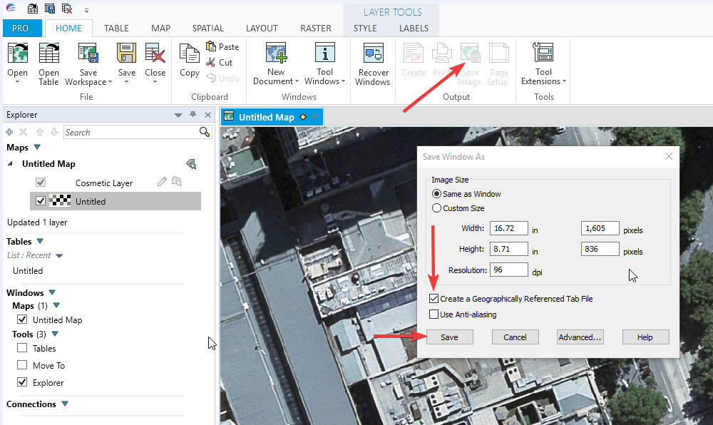

---

sidebar_position: 8

---
# Exporting from MapInfo Pro 

In MapInfo Pro, navigate to the area you want to export and click **Output** > **Save Image**. In the options dialog, check the **Create a Geographically Referenced Tab File** box, then click **Save**. The image will be saved together with an accompanying .TAB file, allowing it to be imported to RapidPlan as described above. You can also export multiple adjacent areas into separate files, then import them into RapidPlan all together.

