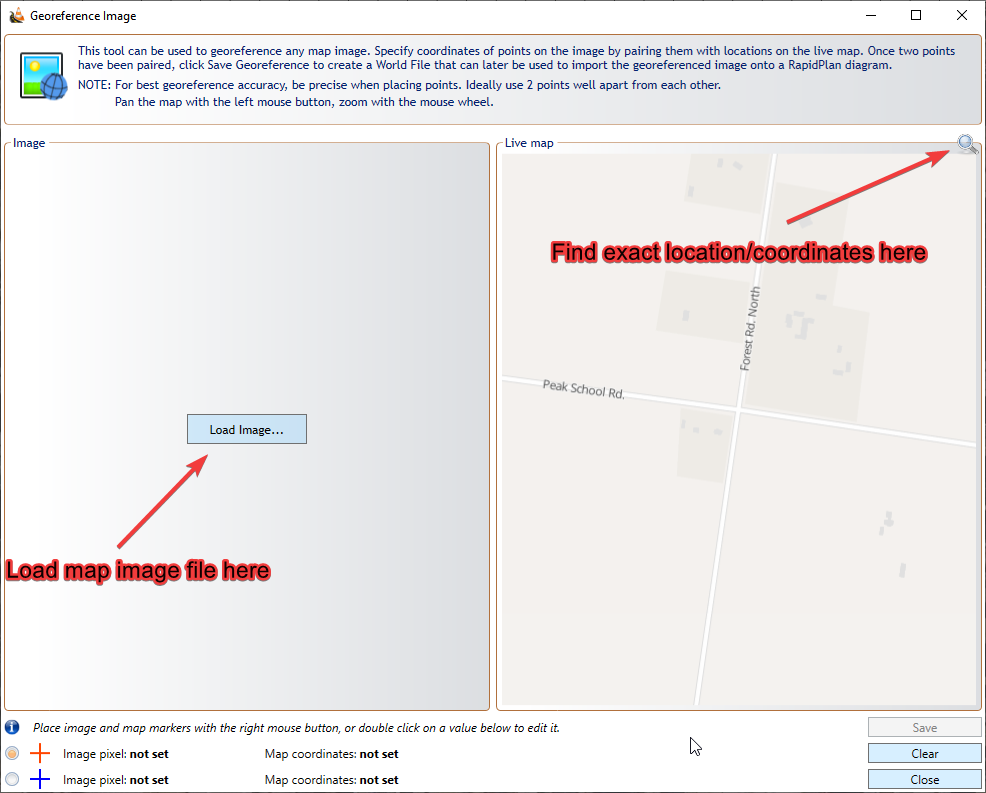
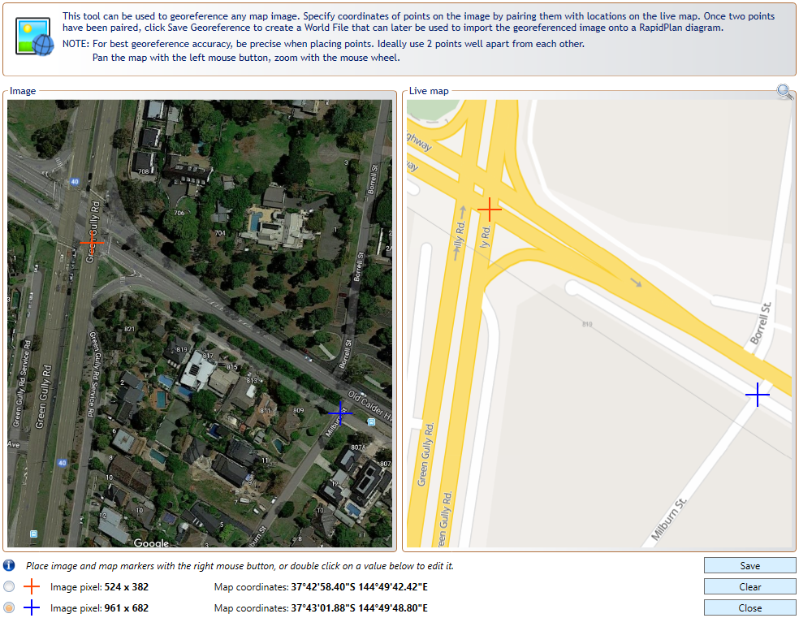

---

sidebar_position: 9

---
# Image georeferencing tool
This tool can be used to georeference any map image imported into RapidPlan (from Google, etc). Specify the coordinates of the image by pairing them with locations on the live map, as shown in Figure 14.9 . This ensures the image is accurately positioned and scale set.

To utilize this tool go to **Tools > Advanced tools > Georeference image files**. The best points to reference are road edges/crossings, buildings edges for your location/coordinates in the live map (this will need to match the imported image).

Once you have loaded the image and found your location on the live map, left click to position each map correctly, then, if required, scroll in/out to accurately set the zoom level - so both maps match accurately, as shown in Figure 14.10.

Then, you need to specify two different pixel/reference points on the map. Do this by right clicking to add a red cross (setting the first pixel point) on each map. Then right click again on each map, to add a blue cross (setting a second pixel point). 

**Note:** Search for points that can be positioned precisely on both maps. Intersections can be useful, as shown in Figure 14.10. Road and building edges can also be used. 

Once the points are positioned, click Save Georeference, to save a World File  (containing the georeference information) for your map.

