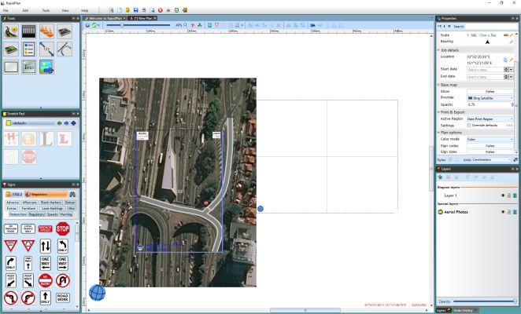

## Importing Photos for a Custom Area of the Plan{.page-break-before}

You can also import aerial photos for a custom area of the plan outside of the Print Region.

**To Import Custom Area:**

 - Select **Tools** > **Import** > **Aerial Photos**.
 - The cursor will become a cross for you to drag your mouse over the plan, selecting your custom area.

    

    