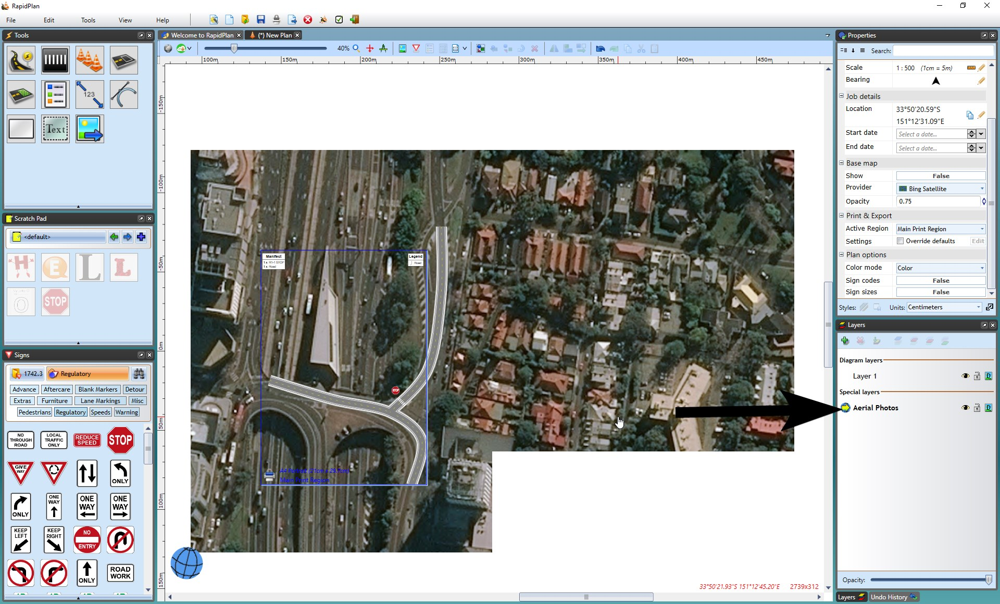

## The Aerial Photos Layer 

RapidPlan automatically places any imported aerial photos to an **Aerial Photos** layer. This ensures that the aerial photos remain the bottom layer of your plan, as the **background**. 

