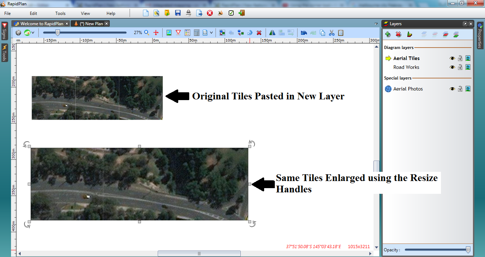

## Moving a Section of Map to another Layer

When on the **Aerial Photos** layer, you can import tiles of the photo for extra coverage.

**To import a tile sized area of the aerial photo**, just double click on the area of the plan.

However, you cannot move or transform these tiles on this layer as the layer needs to keep track of the map region. To manipulate a tile, for example to create a separate section of the plan with a different scale, you need to copy and paste the tiles onto a different layer. 

**To select and move tiles to a different layer:**

 - Select the tiles you want to move by clicking once on the tile, (hold **SHIFT** and continue to click other tiles if you want to move multiple at a time).
 - Right click, select **copy**.
 - Select the layer you wish to move them to.
 - Right click in new layer and select **paste**.

    

    **Note:** The tiles will now be fully editable images, like any other object in RapidPlan.
