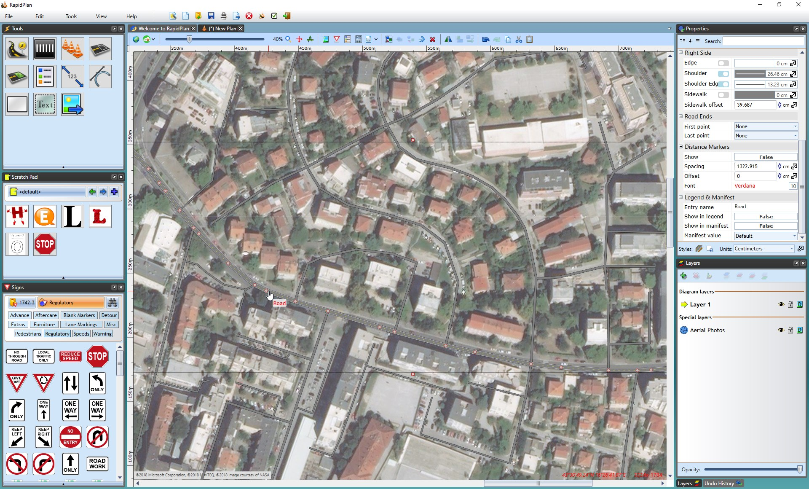

## Importing Roads

Importing roads onto integrated mapping creates a **road object** with properties that can be manipulated.

There are three ways of importing your roads;

 1. Import **all roads in Print Region** by right clicking on the print region printer icon and selecting **Import Roads**.
 2. Select a custom area via **Tools** > **Import** > **Road Layout** to import **all roads in the custom area**.
 3. Select **individual roads** by right clicking on the road and selecting **Import Roads**. 

    