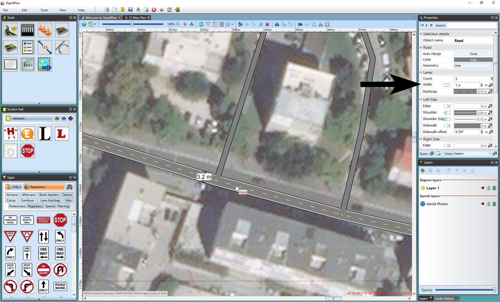

## Matching the Width of Imported Roads

As you have a set scale, you can accurately measure the width of the satellite road with a **distance marker** tool and adjust the road object properties accordingly.
To make this easier, lower the opacity of the layer your roads are on.

