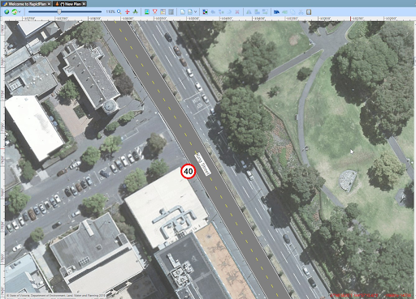

## Matching Road Markings

Once your road widths are adequate, you may need to make some manual adjustments, such as adding **Road Corners** and **Lane Markings**.

**To adjust the road objects to match the satellite image:**

 1. Firstly, adjust the road layer **opacity** in the layers list to see the satellite image through the road object. This will make transferring lane markings much easier.

    

2. You may need to adjust the roads by adding **road corners** or **turning lanes**, etc. Make sure to copy the **style** of the road to each road tool by copying the style from the main road, selecting the new object and using **CTRL + SHIFT +V** to paste the style.

    *For more information of how to use Road tools, see [The Road Tool](/docs/rapid-plan/6.%20The%20Road%20Tool) and [Othr Road Tools](/docs/rapid-plan/7.%20Other%20Road%20Tools/).*

    In the image below, the provider has been changed to the Omniscale, so you can see the road corners are the same style as the road.

    

    **Note:** The Road Corners were placed with the satellite provider to trace the exact shape.

3. When you are satisfied with your roads, add other necessary features such as lane markings.

    *For more information on how to use Lane Markers, see [Chapter 7](#chapter-7-other-road-tools).*

    _Completed_Plan_No_Satellite_(Right).png)

4. Once your base road layout is drawn up, you can print it, use the fax mode icon to convert it or start adding your traffic management information.

**14.6.3 Importing road names and speed limits**

After using the Roads Import tool, right-click on the imported roads and select "Import road data" as seen below in Figure 14.21

After the road data is imported it will display as shown in Figure 14.22. If the required data is available in OpenStreetMaps, your roads will get annotated with names and speed limit signs.

  

