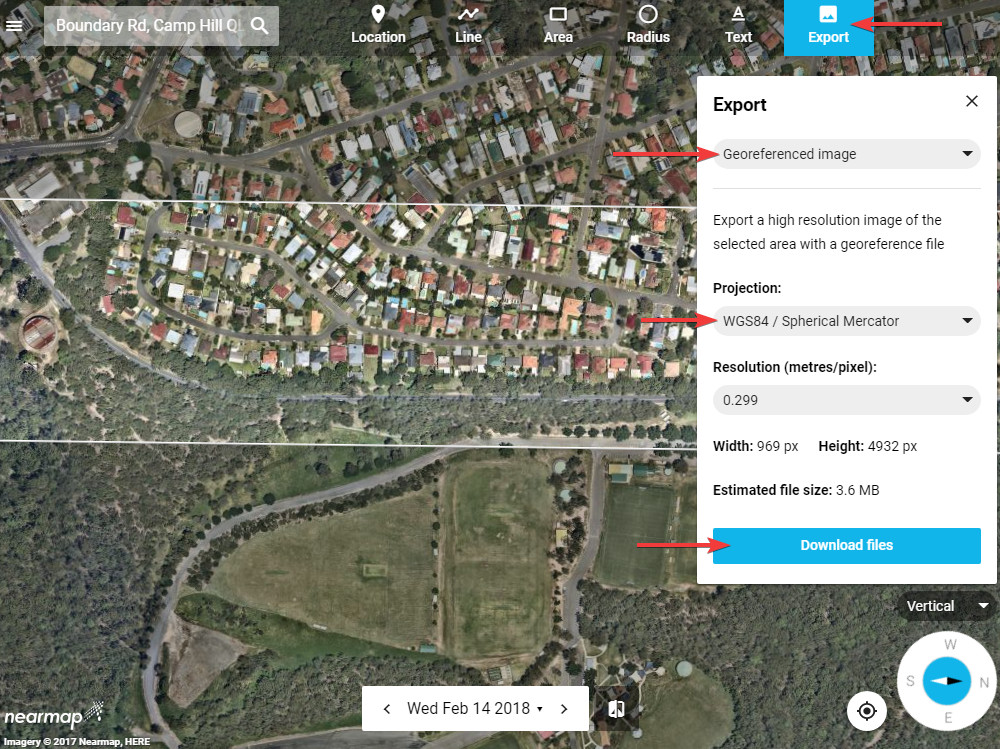

---

sidebar_position: 7

---
# Exporting from NearMap 

In order to create georeferenced images from NearMap, open the NearMap viewer, navigate to your desired location and select the area you want to export. Click the **Export** button at the top, select **Georeferenced image** format and make sure the projection is set to **WSG84 / Spherical Mercator**. Click **Download files** - this will download a zip file containing both the exported image and its georeferenced file. The zip file can be imported to RapidPlan as described above (its contents will get extracted automatically). You can also export multiple adjacent areas into separate zip files, then import them into RapidPlan all together.

