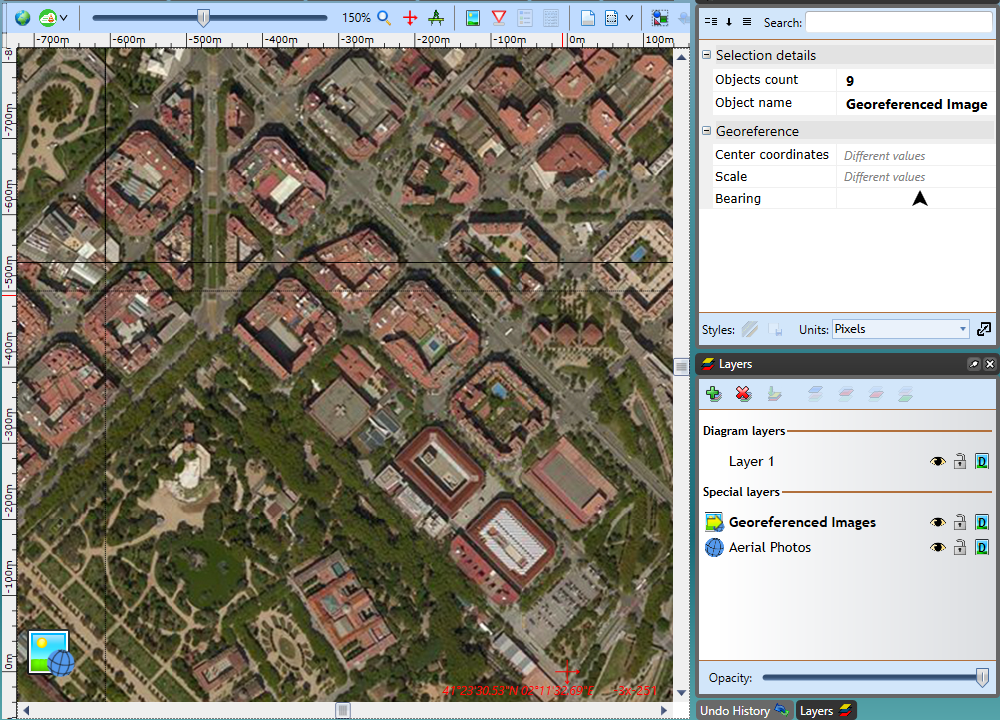

---

sidebar_position: 5

---
# Importing via New Plan Wizard

In RapidPlan, go to **File** > **New Plan Wizard**. Select **Base map** as the plan type.

Click **Add files...** and select the images you want to import. Remember that you can only import images accompanied by georeferenced data, either in a World File format (for example for a .jpg image the corresponding world file will have a .jgw extension) or a MapInfo .TAB format. You can also select zip files that contain both the image and the georeferenced file (such as files exported from NearMap) - these will be extracted automatically.

The files you selected will appear on the scrollable list, displaying data extracted from the georeferenced file: location, scale and bearing. By checking the box on the right side of the list you can select which image is to be placed at the center of your plan. The selected image will also be used to preset the plan location, scale and bearing (other images will have their scale and rotation automatically adjusted to match).

Once you've selected the files, scroll up and click the **Next** button. In the second Wizard step you can confirm that your plan location and scale have been set correctly, then click **Create Plan**. The created plan will contain a dedicated **Georeferenced Images** layer with all the imported images automatically arranged to form a continuous base map.

