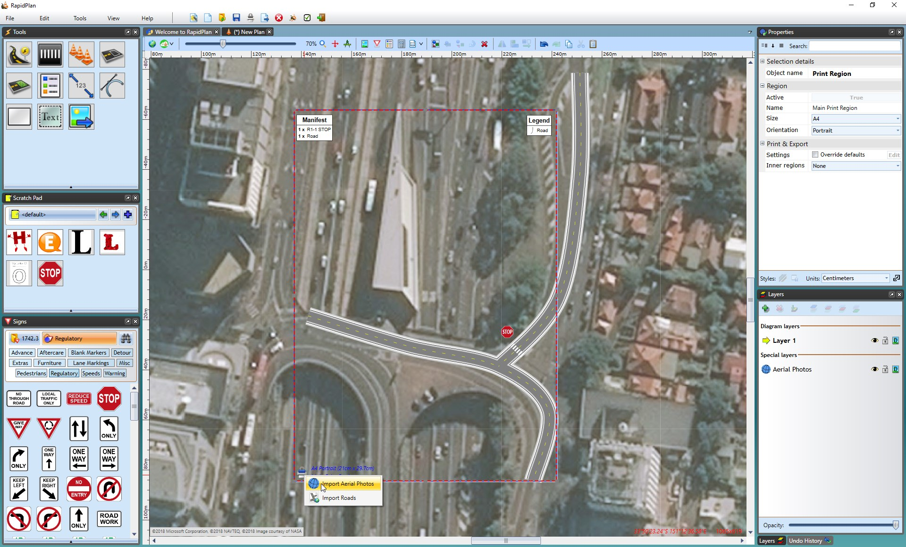
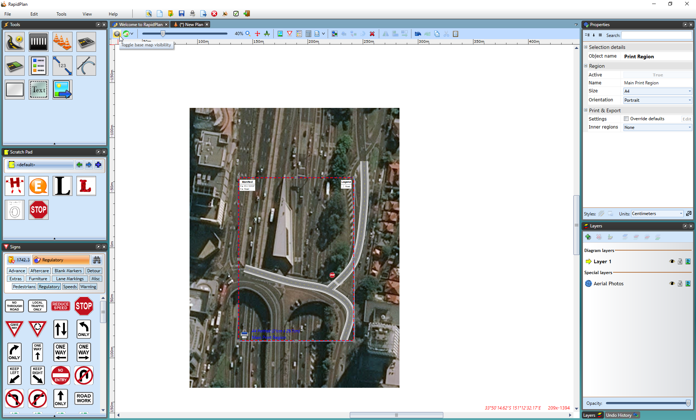
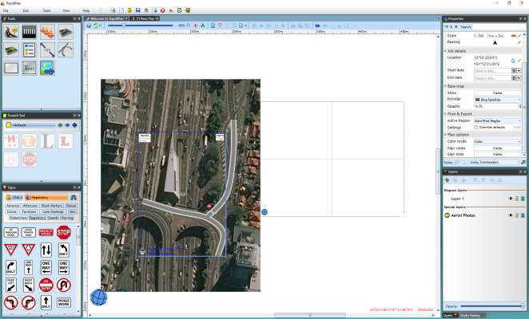
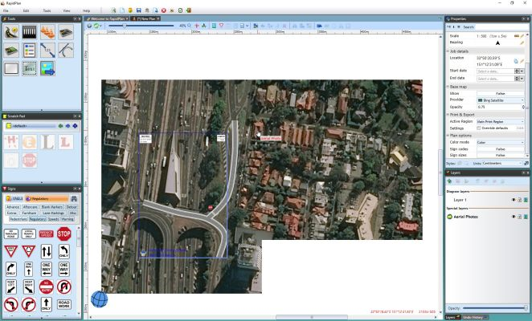

---

sidebar_position: 10

---
# Printing with the Base Map - Importing Aerial Photos

After you have completed your plan onto your base map, if you try to print you may notice that the base map is not printed with your plan. This is because the **base map preview** is not a part of the diagram. 

In order to use the map as the plan's background so it is available when printing or in offline mode, you can use the **Import Aerial Photos** tool. 

## Importing Aerial Photos

 - Right click on the **print region** icon (the printer in the bottom left of the print region).
 - Select Import Aerial Photos.
 - Then you can disable the base map preview with the **Toggle Base Map Visibility** icon in the toolbar so you are only working with the printable map(see below).

    

    

    **Note**: Individual tiles can also be imported individually by right clicking on the area you want to import and selecting **Import Aerial Photo**.

    ## Importing Photos for a Custom Area of the Plan

You can also import aerial photos for a custom area of the plan outside of the Print Region.

**To Import Custom Area:**

 - Select **Tools** > **Import** > **Aerial Photos**.
 - The cursor will become a cross for you to drag your mouse over the plan, selecting your custom area.

    

    
