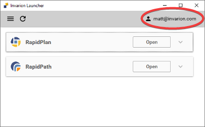
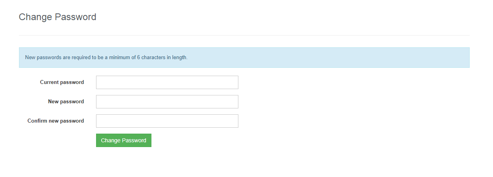

## Changing and resetting password

#### Changing Your Password

If you want to change your password, simply click your user profile email found in the top right of the Invarion Launcher, you will then be directed to your Invarion account page in a browser window.

Once you select 'Reset password' the below window will display, allowing you to change your password.

