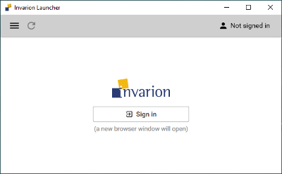
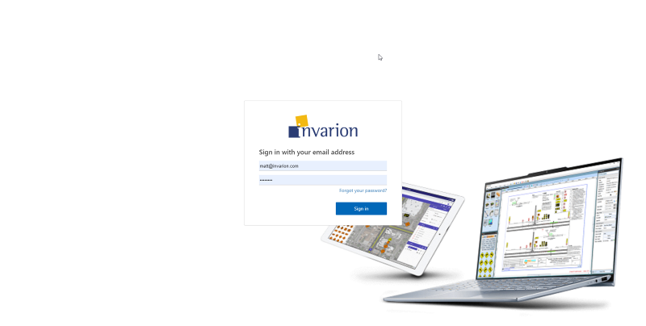
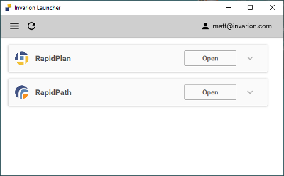
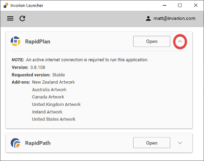
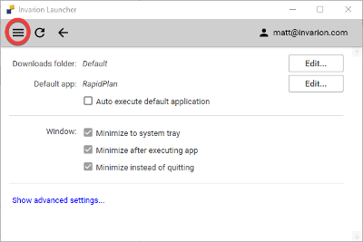

---

sidebar_position: 2

---
# Invarion Launcher Client Intro Screen

Once downloaded, you can login to the Launcher using the username and password provided by Invarion.

If it's the first time a user is logging in, you will be presented with the below instructions in the Invarion Launcher.

Clicking on Sign In will direct the user to a browser window to enter the username and password provided by Invarion. Once the credentials have been entered and the details are accepted, you will be prompted to close the browser window and return to the Launcher.

**If you have forgotten your password**, simply click the 'Forgot your password' link under the login area, you will then be sent to another browser window with steps on resetting your password.

Once the user has logged into the Launcher client, the applications assigned to that user will display. Clicking 'Open' will launch that specific application.

If an update is required, the Launcher will automatically download and apply this prior to launching the application.

To manually check for any updates, simply click the refresh icon in the top left of the Launcher window.

To check which version of RapidPlan you are using, simply click the drop-down arrow.

This will detail the current RapidPlan version you are using, signage packages and any applicable add-ons for your user profile.

Clicking the hamburger icon in the top left of the window will allow you to access the Settings menu.

Here, you can specify the default downloads folder.

If you have both RapidPlan & RapidPath, you can specify which application will launch by default when the Launcher is opened or when any .TCP files are opened from your PC.

The 'Show advanced settings' button contains features that our support team will advise you to access, should you encounter any technical issues.

We advise only to access these settings in those circumstances.
