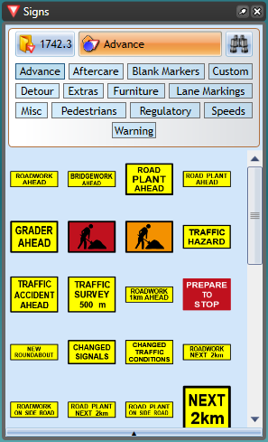

## The Signs Palette

This palette contains road signs you will need to create your traffic guidance scheme. It also carries an array of street furniture and vehicular plant which you can use as part of your site plan. The signs are listed by state allowing you to set the region you are working in. Depending on which countries sign pack you have installed, you may have multiple regions to choose from (for instance in both the United States and Australia, there are various State signage packs available to choose from as well as the national signage). The button on the top left of the palette allows you to select your state displaying the relevant signs that you are likely to need. The other two buttons allow you to search signs by category or using a search bar.

