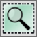
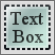

## The Tools Palette

The Tools Palette contains most of the tools you will use to construct the features of your plan.

You can hover your mouse over each Tool to reveal its contents. Continue reading for more information on what each tool icon contains.

 1. **Roads** - This displays each of the tools you can use to construct your road way. 

    *[Chapter 6](#chapter-6-the-road-tool) and [Chapter 7](#chapter-7-other-road-tools) covers this tool set.*
   
    :::{label="Roads" col1="20" col3="20" max-width="80"}
    |                      Roads                       |                     |                                               |             |
    | :----------------------------------------------: | ------------------- | :-------------------------------------------: | ----------- |
    |            | Road                |    | Turn lane   |
    |        | Arc road            |   | Roundabout  |
    |     | Road corner         |  | Road region |
    |  | Intersection Editor |                                               |             |
    :::

 2. **Infrastructure** - This displays infrastructure you may need to construct your plan including train tracks, bicycle lanes, etc.{.page-break-before}

    *[Chapter 7](#chapter-7-other-road-tools) covers this tool set.*

    :::{label="Infrastructure" col1="20" col3="20" max-width="80"}
    |Infrastructure                                          |             |                                                 |               |
    |:---------------------------------------------:|-------------|:-----------------------------------------------:|---------------|
    | | Train tracks|      |Crosswalk      |
    |       | Island      |   |Bicycle lane   |
    |  | Parking bay |       |Sidewalk       |
    :::

 3. **Devices** - This displays devices such as delineators, arrow board and lane status.

    *[Chapter 9](#chapter-9-the-marker-tools) covers this tool set*

    :::{label="Devices" col1="20" col3="20" max-width="80"}
    |Devices                                          |             |                                                           |                     |
    |:---------------------------------------------:|-------------|:---------------------------------------------------------:|---------------------|
    |   | Delineator  |      | Buffered delineator |
    |  | Arrow board |                | VMS board           |
    |  | Lane status |               | LUMS board          |
    |          |Multi message sign   | ||
    :::

 4. **Markings** - This displays various lane markings.

    *[Chapter 7](#chapter-7-other-road-tools) covers this tool set*

    :::{label="Markings" col1="20" col3="20" max-width="80"}
    |Markings                                                |                       |                                                           |                     |
    |:-----------------------------------------------------:|-----------------------|:---------------------------------------------------------:|---------------------|
    |          | Lane marker           |             | Flush median        |
    | | Chevron flush median  |                | Lane mask           |
    |            | Road mask             | | |
    :::

 5. **Zones** - This includes a work area zone and a safety zone.{.page-break-before}

    *[Chapter 9](#chapter-9-the-marker-tools) covers this tool set*

    :::{label="Zones" col1="20" col3="20" max-width="80"}
    |Zones                                                |                       |                                                           |                     |
    |:---------------------------------------------------:|-----------------------|:---------------------------------------------------------:|---------------------|
    |          | Work area             |              | Safety zone         |
    :::
    
 6. **Annotations** - This includes necessary annotation features for your plan such as a scale marker and a legend box.

    *[Chapter 9](#chapter-9-the-marker-tools) covers this tool set*

    :::{label="Annotations" col1="20" col3="20" max-width="80"}
    |                    Annotations                    |                 |                                                      |                |
    | :-----------------------------------------------: | --------------- | :--------------------------------------------------: | -------------- |
    |      | North Arrow     |        | Scale marker   |
    |       | Legend box      |  | Manifest box   |
    |         | Titlebox        |           | Number stamper |
    |  | Zoomed view box |                                                      |                |
    :::

 7. **Markers** - This displays distance markers, an area marker and an angle marker. 

    *[Chapter 9](#chapter-9-the-marker-tools) covers this tool set.*

    :::{label="Markers" col1="20" col3="20" max-width="80"}
    |Markers                                                    |                       |                                                                   |                     |
    |:---------------------------------------------------------:|-----------------------|:-----------------------------------------------------------------:|---------------------|
    |          | Distance marker       |         | Combined distance marker       |
    |   | Offset distance marker|                     | Angle marker                         |
    |              | Area marker           |  | Combined offset distance marker|
    :::
    
 8. **Lines**{id="LinesTable"} - This displays various line shapes that can be used.{.page-break-before}

    *[Chapter 10](#chapter-10-the-basic-tools) covers this tool set*

    :::{label="Lines" col1="20" col3="20" max-width="80"}
    |Lines                                                |                       |                                                           |                     |
    |:---------------------------------------------------:|-----------------------|:---------------------------------------------------------:|---------------------|
    |           | Polyline              |                   | Spline              |
    |             | Bezier                |                      | Arc                 |
    |              | Arrow                 |              | Marked path         |
    :::

 9. **Shapes** - These simple shape tools allow you to create your own objects and signs for your plans.

    *[Chapter 10](#chapter-10-the-basic-tools) covers this tool set*

    :::{label="Shapes" col1="20" col3="20" max-width="80"}
    |                       Shapes                        |                   |                                                 |               |
    | :-------------------------------------------------: | ----------------- | :---------------------------------------------: | ------------- |
    |          | Rectangle         |         | Elipse        |
    |  | Rounded rectangle |        | Polygon       |
    |      | Filled spline     |  | Filled Bezier |
    |               | Grid              |        | Arc pie       |
    |             | Cloud Shape       |                                                 |               |
    :::

 10. **Text**{id="TextTable"} - These text options can allow you to add a text box, name roads, hyperlinks and create signs.

     *[Chapter 10](#chapter-10-the-basic-tools) covers this tool set*

     :::{label="Text" col1="20" col3="20" max-width="80"}
     |                     Text                      |             |                                              |            |
     | :-------------------------------------------: | ----------- | :------------------------------------------: | ---------- |
     |  | Text object |    | Text box   |
     |    | Text pair   |  | Arrow text |
     |  | Callout box |   | Path text  |
     |        | Text table  |        | Hyperlink  |
     :::

 11. **Image**{id="ImageTable"} - This allows you to open an image from your computer to your plan.{.page-break-before}

     |Image                                     |                       |
     |:----------------------------------------:|-----------------------|
     |   | Import image          |
     :::

