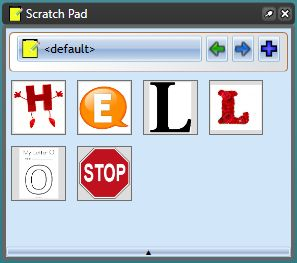
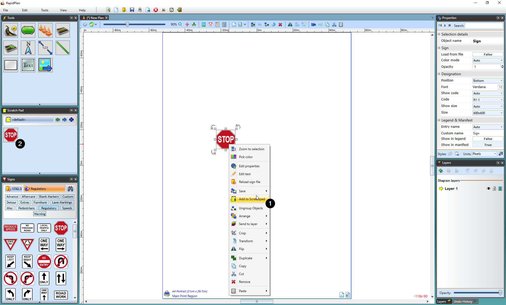

## The Scratch Pad

The Scratch Pad is used to store objects that you commonly use to make them easily accessible. 

To place an object in the scratch pad palette, select the object then right click and select **Add to Scratchpad**.

