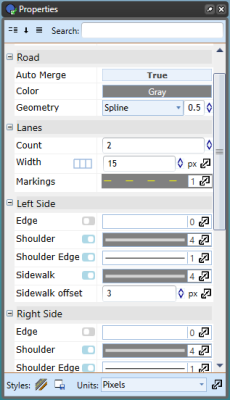

## The Properties Palette

The Properties palette displays all the information pertaining to any selected signs, tools, markers or objects. This is where you can change fonts, colors, lane markers, etc. of the selected feature. 

You can also double-click an item from your plan to display the property parameters in Quick Edit mode.

