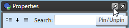

---

sidebar_position: 4

---
# The Palettes 

There are five main palettes that will appear on the screen initially, which between them contain virtually all the tools you will use in creating your plan. There are three tabs that appear vertically docked to the left of your canvas; the signs palette, the scratchpad and the tools palette, while the properties and layers tabs will appear to the right of your canvas. 
When hovered over with your mouse the palettes become visible, you then have the option to click on pin/unpin (right corner of the palette) or to click on the "x" to close the palette. You can also right click on the top bar of the palette and choose to have your palette float anywhere on the screen.

