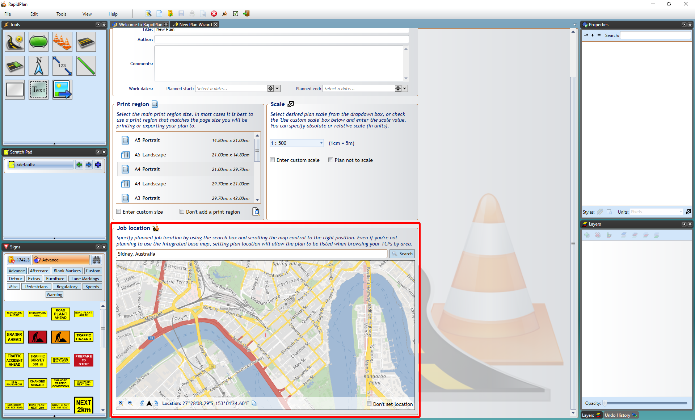

## Base Map

Select this plan type if you're drawing a plan for a specific job site. It will let you display a site preview map, import aerial photos as the plan's background and draw road networks automatically.

**Creating a New Plan from a Base Map:**

- Select **New Plan Wizard** in the Quick Start section of the Welcome to RapidPlan page.
- In **step 1**, select **Base Map**.
 - In **step 2** enter your plan details and choose a print region and scale, or leave them as default.
- Scroll down to **Job Location** and type in the address for your job in the search bar and click **Search**. 
- Select **Create Plan** and your plan will load on your canvas as shown in the image below.

    **Note**: in the Properties Palette you can change the provider of the map from omniscale, satellite and hybrid. 

    

    

