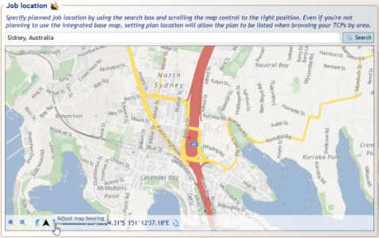

## Base Map Bearing

The bearing of a base map is adjustable, enabling you to draw plans at any orientation. To adjust the base map bearing:
1. Create a new plan in new plan wizard
2. Select the Base map plan type
3. When choosing job location, adjust bearing to liking as shown below.

The base map bearing can also be adjusted in the properties tab on the right hand side once map has already been inserted into the plan as seen in the image below.

**Note:** To fine tune the bearing adjustment hold down the **CTRL** key and click and drag the mouse around on the map to get the desired position.

