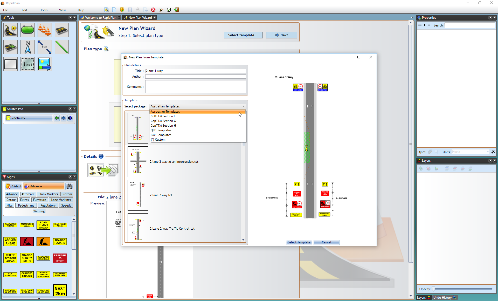

## Static Template

This creates a new plan base on a TCP template selected from a library of typical jobs. Objects imported from the template are editable so you can adjust the drawing for the specific job you're planning. You can also create your own templates to access here and work from.

**Creating a New Plan from Template**

 - Select **New Plan Wizard** in the Quick Start section of the Welcome to RapidPlan page.
 - In **step 1**, select **Static Template**.
 - A **New Plan From Template** window will appear as shown in the image below, where you can select your regional template package and your template.
 - Once you have chosen your template, click **Select Template**.
 - You will be taken back to **step 1**, now select **Next** at the top right of the window.
 - You will now be at the **step 2** window where you may see your template's details already there. You can keep these and the default settings or enter your own details.
 - Select **Create Plan** and your template will appear on your canvas  as shown in the image below.

    

    