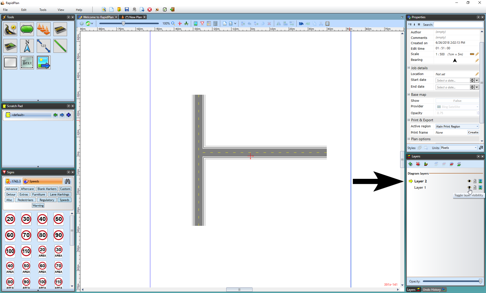

## Changing Layers

The final aspect of navigation around the canvas is cycling through the layers. In older versions of RapidPlan (<3.0) the **Layers List** was not shown when initializing RapidPlan. In the new version of RapidPlan, layers palette is visible by default and it's combined along with **Undo history** tab. Hovering over the icons with your mouse will display their respective functions.

*See [Chapter 13](#chapter-13-using-layers) for more information on Layers.*