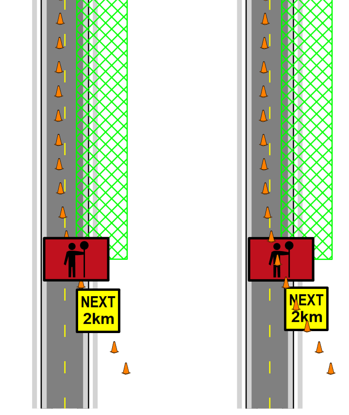

## The Concept of "Canvas Ordering"

An important function of the RapidPlan canvas is the ability to order objects. The following diagram demonstrates the concept of ordering.

Ordering is a very important concept to understand because inevitably during the course of your plan creation you will need to move something over or under something else that you've already drawn. Fortunately, the ordering process is simple.