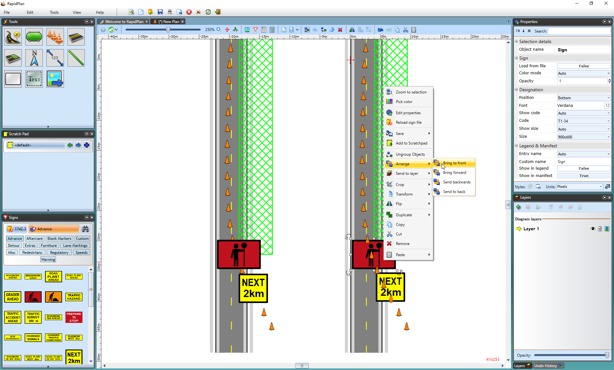

## Changing the Order of Objects

**To change the order of objects on the canvas with the mouse:**

 - Select the item that you wish to alter the order of.
 - Once it is selected, right click on the object.
 - Select **Arrange** > 
    - **Bring to front** - on top
    - **Bring forward** - one step forward
    - **Send backwards** - one step backward
    - **Send to back** - on bottom

You can also use the keyboard shortcut keys to effect the change, which will be faster and easier.

**To change the order of objects on the canvas with the keyboard:**

 - Select the item that you want to alter the order of.
 - Hold:
    - **ALT + Home** - Bring to front
    - **ALT + Page Up** - Bring forward
    - **ALT + Page Down** - Send backwards
    - **ALT + End** - Send to back

**Note**: the reordering of items happens only inside the scope of the given layer. That is to say that if you are operating on a lower layer and attempt to bring an object to front, it will still be drawn behind anything on a higher layer.