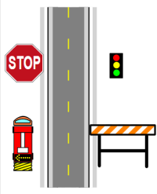

## Fax Mode

Have you ever tried to fax something that's in color, and found that it's barely readable at the other end? The reason for this is because of low contrast between items in the initial document. Fax machines are great at black and white documents, or low color documents created with fax machines in mind. But for high color documents they can be downright troublesome - that's why RapidPlan has a very clever Fax mode which converts everything to pure black and white. Every RapidPlan element has a Fax Mode form.

## Applying Fax Mode

In order to make faxing easy, each element in RapidPlan has a fax friendly form. This applies to roads, signs, everything. A few examples are below:

|Color mode                         |Fax mode                               |
|:---------------------------------:|:-------------------------------------:|
| |  |

Switching Fax mode on and off is simple. Just click on the Toggle Color/Fax mode button from the Options toolbar. Your entire plan is updated with a single button click.

## Making Your Own Signs in Fax Mode

You can create and edit fax mode versions of your own signs and objects. This can be done by selecting **View** > **Sign Editor**.

*See [Creating Your Own Signs](/docs/rapid-plan/12.%20Creating%20Your%20Own%20Signs/Chapter%2012%20Creating%20Your%20Own%20Signs.md) for more information on Making Your own Signs.*