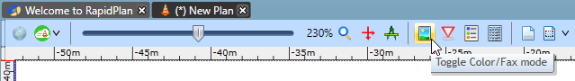

## Applying Fax Mode

In order to make faxing easy, each element in RapidPlan has a fax friendly form. This applies to roads, signs, everything. A few examples are below:

|Color mode                         |Fax mode                               |
|:---------------------------------:|:-------------------------------------:|
| |  |

Switching Fax mode on and off is simple. Just click on the Toggle Color/Fax mode button from the Options toolbar. Your entire plan is updated with a single button click.

