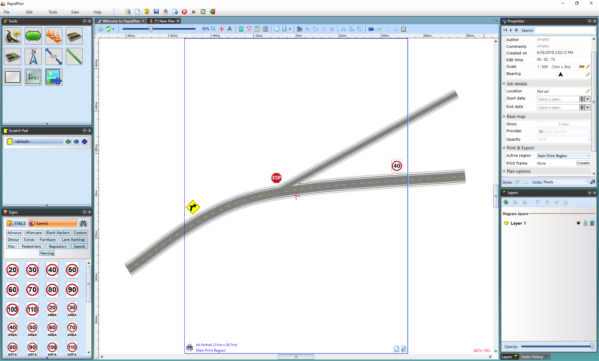

## The Print Region Guide

The key to the Unrestricted Canvas is the blue Print Region guide. This box allows you to build plans that "fit" the shape of a piece of paper without constraining you to a fixed page size.

**Note:** You can have more than one Print Region

Notice in the above example, that its possible to draw outside the bounds of the page guide. That's because (as the name suggests) it is a print region not a firm boundary.