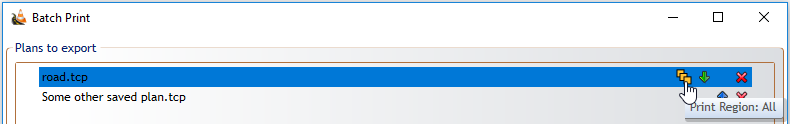
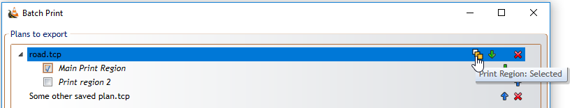

## Printing Canvas Plans 

The importance of the page guide is at it's greatest when printing, because on unrestricted canvas plans there are different printing options available to you. 

You can access the Print Options by clicking on **File** > **Print** > **Print Options**. The Print Options box will open similar to the one below.

As you can see there are many options to choose from. Irrespective of what you have on the canvas, everything you have drawn can be stretched or shrunk to fit on the paper size you choose. There are many available page sizes to choose from as well as the option for creating a custom size. There is also the option for printing on multiple pages.

If you have more than one print region, or you want to print regions from other plans, you use the **Batch printing** option.

You can access Batch Printing by clicking on **File** > **Print** > **Batch Print**. There you can add files or add open files, select which regions you want to print (some or all of them), sort in which order to print (manual sort, sort by alphabetically, creation date  or by last edit). 

If there is more than one print region on added plan, there will be **Three Rectangles** icon on top right corner. Orange filling of every rectangle represents different option:
- Print just active region
  
    

- Print all regions on plan
  
    

- Print just selected region(s)

    