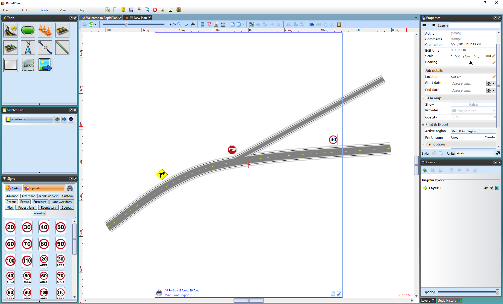
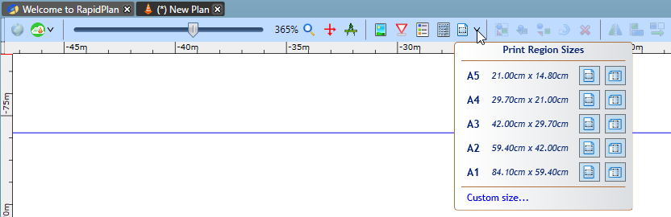
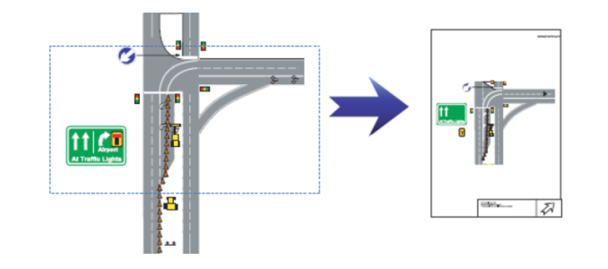
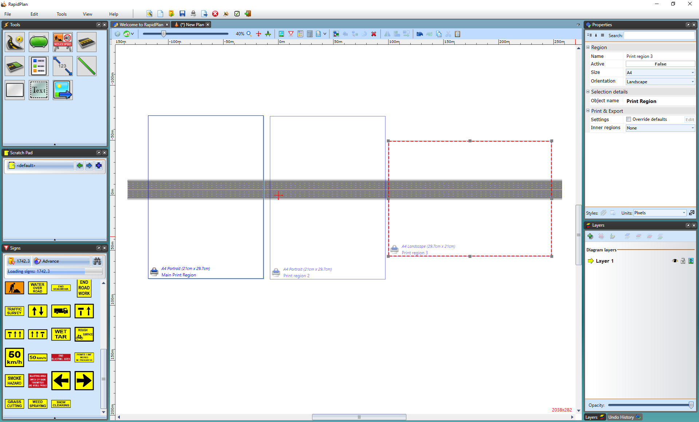
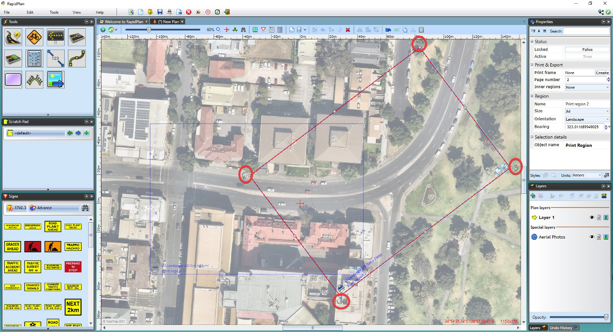

# Print Regions

The key to the Unrestricted Canvas is the blue Print Region guide. This box allows you to build plans that "fit" the shape of a piece of paper without constraining you to a fixed page size.

**Note:** You can have more than one Print Region

Notice in the above example, that its possible to draw outside the bounds of the page guide. That's because (as the name suggests) it is a print region not a firm boundary.

In the example below, everything outside the print region guide is ignored. Multiple print regions can be added to your plan which allows you to designate which print regions to allow active for printing.

**Note:** The Print Region in this Image is displayed as red.

RapidPlan also allows you to print small sub-sections of your plan. This is especially useful on large traffic plans with multiple traffic treatments that you want to print on individual sheets of paper. Simply draw your entire plan, mark the section that you want to see on paper using the Add Print Region icon, then print (or export using **File** > **Export**). 

By clicking the Add Print Region icon in the tool bar your cursor allow you to create a custom print region by clicking and dragging your cursor across your plan. Alternatively, you can select the down arrow next to the icon which will give you more size options for print regions as shown below.

Similar to the previous example, only what is inside the defined blue print region below would be printed to paper. Everything outside would be ignored.

As shown below multiple Print Regions can be added to the one plan. Print Region 3 was selected by clicking the printer icon in the bottom left corner of the print region, highlighting the region as red. If you then place the cursor over a corner of the region, it becomes an arrow and allows you to change its shape and size of the print region to your preference. 

You can remove, activate or deactivate print areas. Only print areas that are Active will print. You can change the Active Print Region by selecting the printer icon in the desired print region, making the perimeter a bold blue, as seen below.

**Note**: These changes to the selected print region can also be made in the properties palette.

To remove a print region, select the region by clicking on the printer icon in the bottom left of the print region. Then go to **Edit** > **Remove**. 

## Rotating Print Regions

Print regions placed on the canvas area can also be rotated. This is useful when planning works on a long and windy road, where each page might need a slightly different bearing

To rotate a print region, click on the printer icon in the bottom left of the print region, then use the rotation handles on each corner of the print region to rotate to any angle.

When the print region is selected, you can also adjust the exact degree of the bearing in the Properties palette under the ''Region'' subheading.

