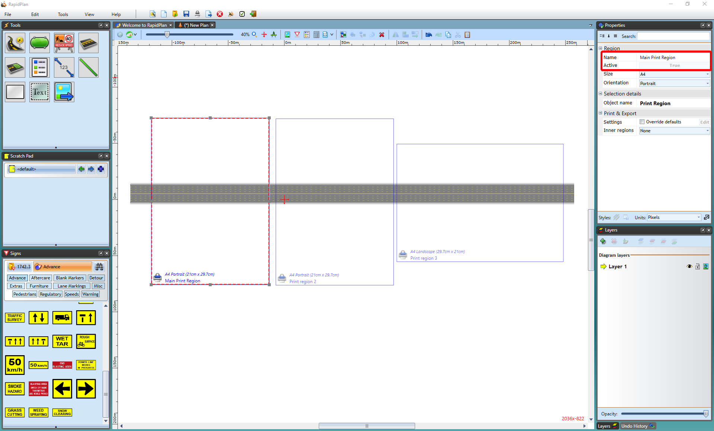

## Which Way will RapidPlan Print?

 - Default RapidPlan print (**File** > **Print active plan** or **CTRL + P**) will print only one, **Active** print region. 

    

 - To print more than one print region, use **Batch Print** 