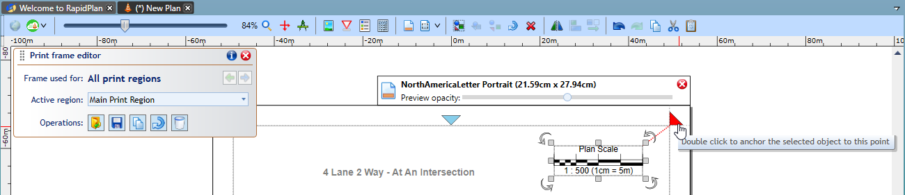

## Anchoring frame objects

Anchoring objects to frame edges can be used to ensure they're always positioned the same way with respect to the page border, regardless of the current page size and orientation. This makes your frames more flexible as they'll automatically adjust to any printout dimensions. To anchor an object, select it and double-click on one of the 8 anchor points represented by blue triangles. This will automatically move the object towards the anchor point. If you prefer to create the anchor without moving the object, hold the **CTRL** while double-clicking. In either case, the object's offset from the anchor point will be preserved when the page size changes. 

You can also right-click on the anchor point to see the available options.

Going back to the full print frame example presented above, let's anchor each object to the closest page corner and check how changing page size and orientation affects the page preview. As you can see below, the frame contents are still positioned against the corners even after we change the page size.

It is sometimes desirable that the frame rotates its objects when page orientation changes, for example when the plan is using a single frame but has multiple print regions of different orientations. Frame rotation can be done manually with the button located on the Print Frame Editor panel, or by selecting an Auto-rotation mode from the frame Properties.

