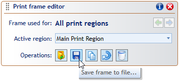

## Print Frames - Typical usage scenarios

Frames you create for specific plans and print regions are saved together with the plan. The print frame editor additionally allows saving frame contents to separate .tcpf files, so they can be reused on other plans. If you have one or more standard sets of annotations you use for your TCP documents, paste each of them on a print frame and save the frames to separate files. Then anytime you create a new plan, you can load the appropriate pre-saved frame file and only upload the plan-specific details like job location or permit number.

