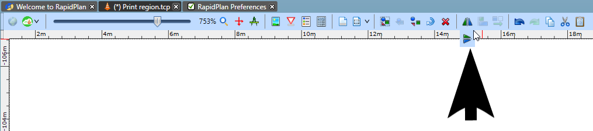
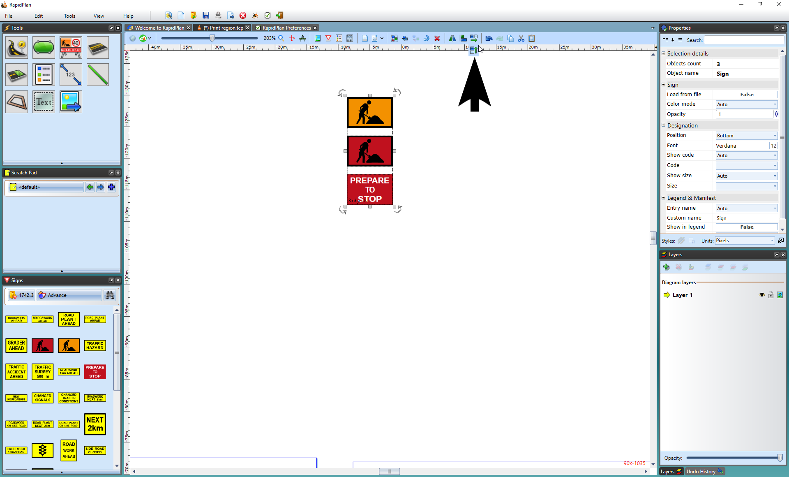

## Flip, Alignment and Spacing Toolbars

### Flip Toolbar 

The flip toolbar allows you to flip selected objects, signs, roads, etc., either vertically or horizontally. You can also rotate these objects after selecting them by hitting **CTRL + R** on your keyboard.

### Alignment Toolbar

This toolbar allows you to align boundaries of selected objects, signs, roads, etc. This toolbar only becomes visible when more than one object is selected.

###  Spacing Toolbar 

The spacing toolbar allows you to distribute any selected objects horizontally or vertically. This toolbar only becomes visible when multiple objects (three and more) are selected and encapsulated.

