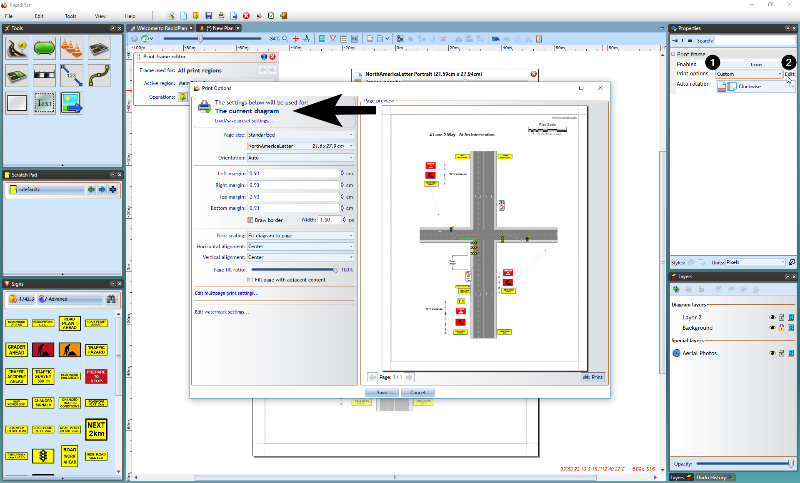

---

sidebar_position: 19

---
# Print Frames - Overriding Print Options 

By default, when printing or exporting TCPs RapidPlan uses the application-wide settings specified in the **File** > **Print** > **Print Options** dialog. However, when creating a print frame it is possible to make it override the default settings and use its own options (for example when a specific print region should be printed to a different paper size). While editing a print frame, go to its **Properties palette**, change **Print options** to **Custom**, then click **Edit**. This will open a print options dialog that lets you specify settings to be used when printing the current plan or region only (depending on whether your frame is defined for the plan or region).

