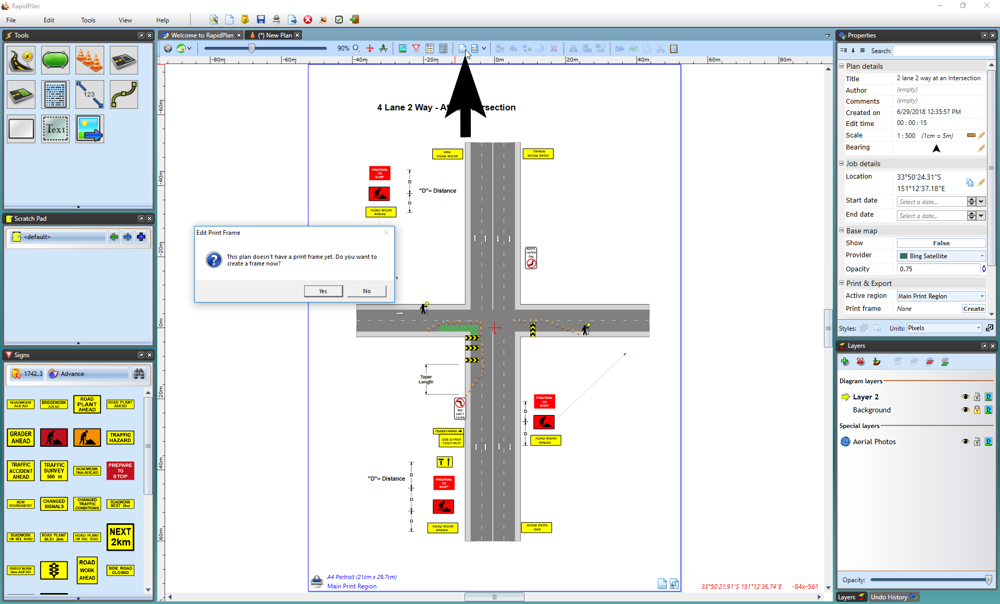
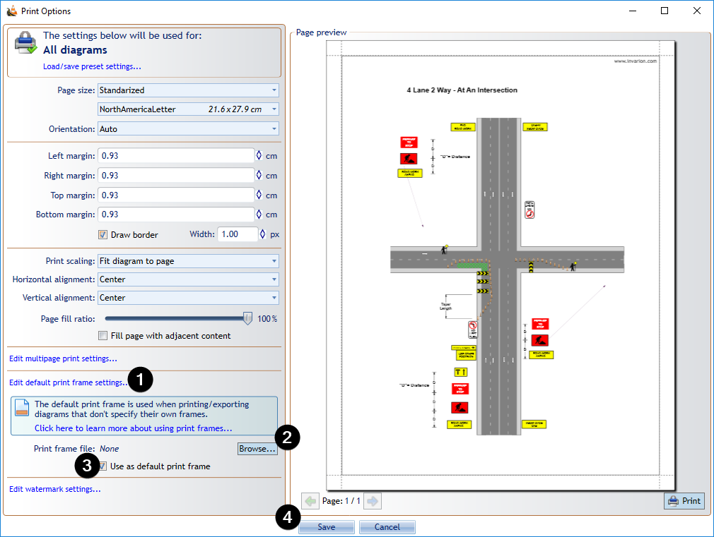

---

sidebar_position: 15

---
# Print Frames

## Typical usage scenarios

- Reusing standard TCP annotations - if your TCPs need to have a similar titlebox layout (company logo, job details, planner signature, permit number), you can extract these annotations into a print frame and reuse the frame for different TCPs, only adjusting the necessary details.
- Adjusting annotations to page size - print frames automatically adjust to the current print page size and can auto-rotate their content to ensure annotations are printed in the same position regardless of whether you're printing in portrait or landscape orientation.
- Aligning annotations with page edges - when the proportions of your print region don't exactly match the proportions of the page printable area, you're often left with additional margins between the page border and the content that's scaled to fit inside. Anchoring annotations to frame edges ensured they're aligned with printout borders.
- Preventing annotations from obscuring other print regions - when drawing plans with multiple overlapping print regions, extracting annotations to print frames prevents them from obscuring contents of other regions.

## Creating print frames

Print frames can be defined either for individual print regions or for the whole plan (in which case the same frame will be used for all print regions). To create a plan frame, use the toolbar button. To create a print region frame, double click on the region's print frame icon. A popup dialog appears, confirming that you're about to create a new print frame. Once a print frame is created the corresponding icon changes color and can be used to open the frame editor view.

The print frame editor view presents a preview of the printout page with TCP contents scaled to fit inside the page (page size, orientation, margins and the content scaling mode are based on the current print options). You can now start drawing frame objects on top of this page preview and they'll be positioned exactly the same way when you actually print or export the plan. The frame editor mode allows using all kinds of objects and editing them like on a regular plan layer.

Once you're done editing the frame, you click one of the red X icons or press the **Escape** key to go back to close the frame editor view. Anytime you need to edit the frame again, use the plan toolbar or print region frame icon. Alternatively, right-click on the print region icon and select **Edit print frame**.

## Setting a default frame

If you're using a single frame template for most of your TCP documents, you can make it the default frame, which means it will automatically be used when printing/exporting diagrams that don't specify their own frames. Save your frame as a .tcpf file, then go to **File** > **Print** > **Print Options** and click **Edit default print frame settings**. This expands a panel letting you browse for the pre-saved frame file. Check the **Use as default print frame** box and the frame contents should appear on the Print Preview. Click Save to close the options dialog.

