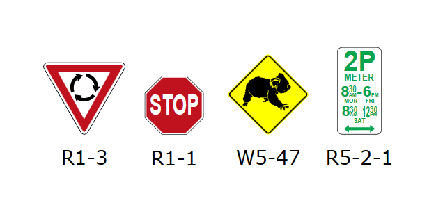
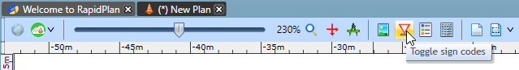

---

sidebar_position: 12

---
# Sign Designation Mode

Just about every sign packaged with RapidPlan has its unique sign code stored with it. When you activate Sign Designation mode, the codes are displayed as shown below:

Like fax mode, you can turn Sign Designation mode on and off by clicking on the Toggle Sign Designations button from the Options toolbar.

*See [Creating Your Own Signs](/docs/rapid-plan/Creating%20Your%20Own%20Signs/Creating%20Your%20Own%20Signs.md) for more information on how to create your own signs with stored code designations*