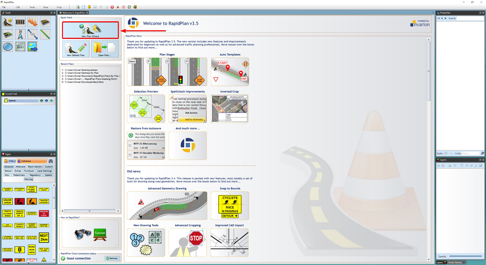
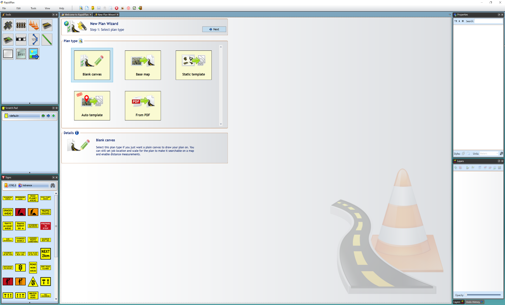

---

sidebar_position: 1

---
# The New Plan Wizard

The first step in RapidPlan is choosing a canvas to work on. The New Plan Wizard allows you to select a type of plan and specify details of your plan (such as scale, print region, etc.) before you begin (which a **New Default Plan** does not). 

The New Plan Wizard can be accessed from the **Quick Start** section of the Welcome to RapidPlan tab. If this tab is closed, the wizard can also be accessed by going to **File > New Plan Wizard**. 

Once you have selected the **New Plan Wizard** option, you will have four plan types to choose from in **step 1**:

 - Blank Canvas
 - Base Map
 - Static Templates
 - Auto Template
 - From PDF 

After you select your plan type, **step 2** allows you to enter plan details, such as a title, author, comments and relevant job dates. You can also choose a print region, set a scale and enter your job location site. 

If you choose not to enter any details here, a default print region and scale will be set and any details can be changed at any time from the Properties Palette.
