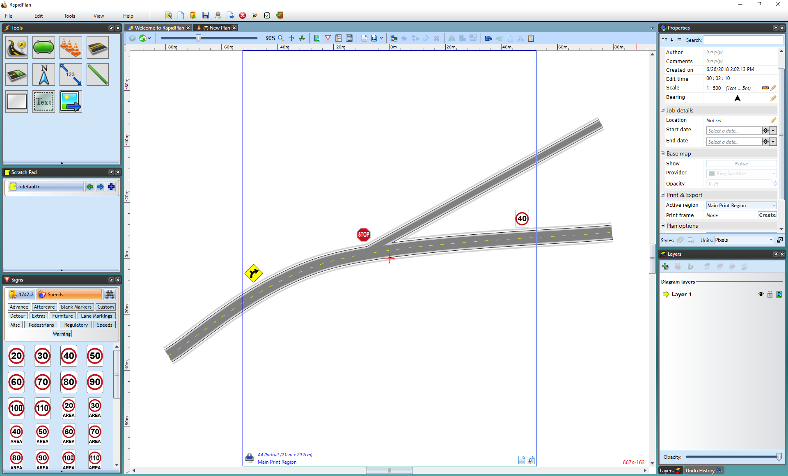

---

sidebar_position: 7

---
# Unrestricted Canvas

RapidPlan offers an unrestricted canvas. Virtually limitless in size, this canvas allows you to draw anywhere from a small simple plan to enormous traffic management plans when you need to. With no restriction on size, it's ideal for applications like races, parades or large scale, multi-block road closures. It has a range of printing options which allow you to print either your entire plan, or just certain sections as you need. This is especially useful for large jobs which have multiple traffic treatments which you may wish to print into individual plans.

To view or edit your plan properties just use the Properties Palette located to the right of the canvas. Properties can also be accessed through **Edit > Plan Properties** or default shortcut key **F2**.

