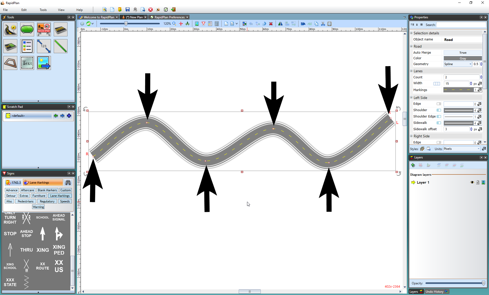
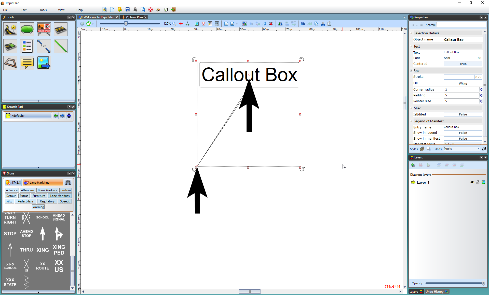

## Control Points 

Almost every element in RapidPlan has at least one control point. A control point is a handle that allows you to alter the shape of an object. They appear in RapidPlan as small red circles. Control points do different things to different kinds of objects, and different objects have different numbers of control points.

The control points along the road enable you to adjust its shape.

Callout boxes have two control points - one to position the head and one for the tail.{.page-break-before}

To view an object's control points you must select it. Once you have selected an object, you can move its control points around to change the shape and of the object.