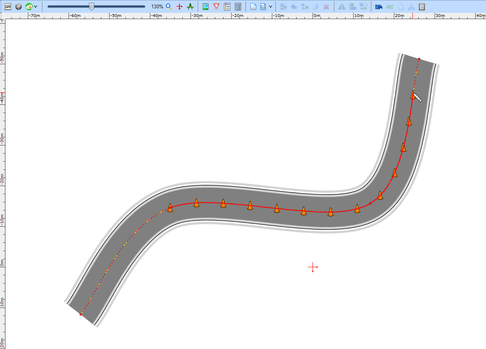
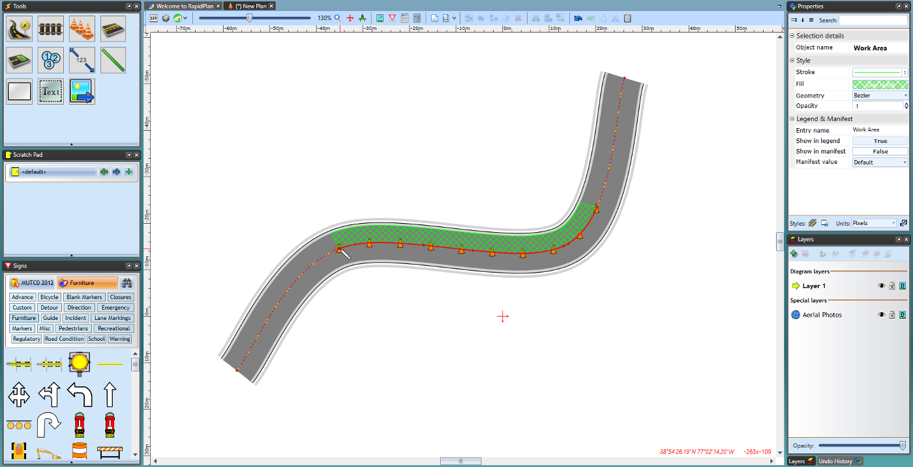

## Drawing along geometries 

Snap to an existing geometry when drawing an object and RapidPlan will automatically create control points to fit the desired curve.

This is useful when needing to draw delineation devices or a work area along a curved geometry.

To being drawing along a geometry, simply left click your device along the red geometry where you want the device to begin. The tool will then follow the curve you draw out, as seen in Figure 5.11 below.

While drawing an object you can snap its segments to different geometries as well. This can be done by snapping points to existing geometries and tracing the drawing along it, as seen in Figure 5.12 below.

