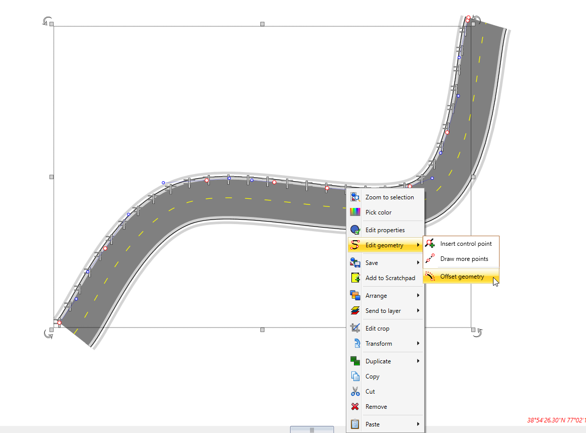

## Offsetting the geometry

Use the Offset Geometry tool to further adjust the position of an object.

To utilize the offset tool, simply complete your drawing along the geometry, once completed, right click and select 'Offset geometry' in the right click menu displayed (shown below).

Simply click and drag to your desired offset, or type your desired offset value in the offset dialogue box, as shown below.

Once the offset has been created, right click to save your changes.