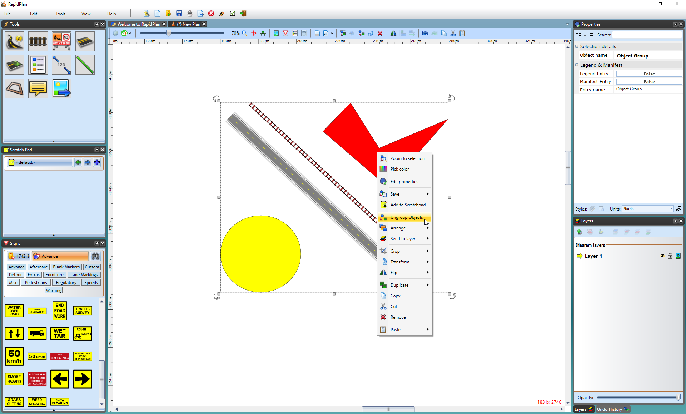

## To Ungroup a Group 

 - Select the necessary group.
 - Either right click on the group and select **Ungroup Objects**, use the Ungroup icon in the toolbar or use the shortcut key **CTRL + U**.

**Note:** Grouped objects can edited without ungrouping. Double click on the group item to launch the quick edit box - you will then have the option to change the properties of a particular object in the group. 