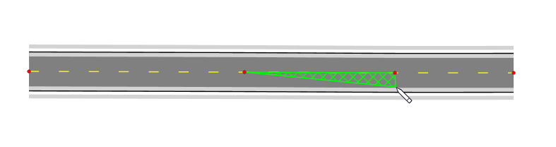

---

sidebar_position: 16

---
# Control Point Snapping 

Once you have selected an object and can view its control points, you can seamlessly connect objects to one another by snapping into existing control points. Hold the **CTRL** key while point-snapping roads/work areas or other objects and their geometries will merge.

This feature will help you to create a neat and straight-lined work area.

**Tip:** If you want to snap control points across multiple layers/stages, hold *Ctrl+Alt* while drawing or transforming objects. This is particularly useful when drawing complex plans with multiple stages, as it allows hassle free snapping to base stage objects like road lanes and edges.

**Note:** You can also snap points and align drawn segments not only at control points, but anywhere along a snap geometry as shown in Figure 5.12 below.

