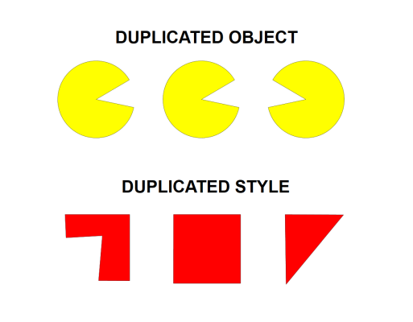

---

sidebar_position: 34

---
# Duplicating Styles onto Other Items

As shown in the image below, you can paste the style/properties of one item onto other items. This can be useful when, for example, you have different road tools in use (eg. road, roundabout, arc road) and you want to give them all the same style/properties.

**To duplicate a style onto a different item:**

 - Select the item to duplicate style.
 - Press **CTRL + C**
 - Now select item to transfer the style onto it.
 - Press **CTRL + SHIFT + V**
