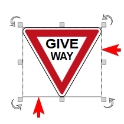
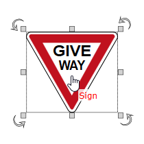
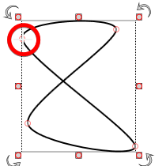

---

sidebar_position: 8

---
# Features Accessed by Selecting an Object

Once you have selected your object, a number of new tools become available. Its important that you understand what each tool does as you will come to rely upon them heavily.

|Object                                             |Features|
|---------------------------------------------------|--------|
|    |**Bounding Box**  The bounding box shows you exactly which objects you have selected. In this example there is only one selected object - the Give Way sign.|
|  |**Resize Handles**  The resize handles allow you to stretch or shrink the selected object. When selected, every object will have eight resize handles; three at the top, three at the bottom, and two on the lateral sides of the bounding box. Note that when the cursor hovers over a resize handle, the handle turns red and the cursor becomes a cross.|
||**Rotation Handles**  Click and drag a rotation handle to "free rotate" an item. This example has four rotation handles - an arrow in each corner of the bounding box. Note, again, when the cursor hovers over a rotation handle, the handle turns red and the cursor becomes a cross. Drag the handle in any direction to rotate an item.            |
|    |**Move Handle**  To move an item, simply hover over it with your mouse and drag it anywhere around your canvas. The cursor will change to a hand pointer when you hover over an item.                                                                                                                                                                       |
|  |**Control Points**  Control points are special handles which allow you to alter the shape of an object. Many objects and road tools have control points and allow for the insertion of multiple control points anywhere along an item. This example has six control points.                                                                               |
