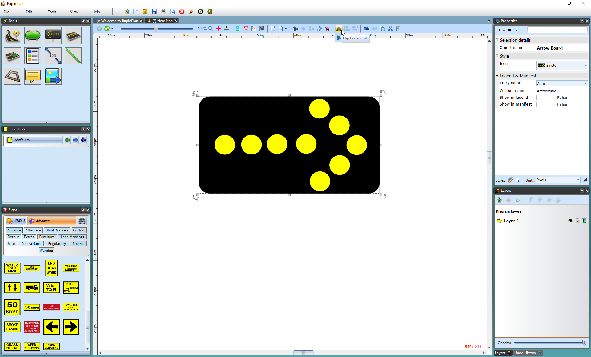

---

sidebar_position: 25

---
# Flipping Objects

As well as rotating objects, you can also flip them either horizontally or vertically using the flip buttons on the Flip toolbar. Note however, that the flip buttons are only ever visible when an object which can be flipped is selected. (Users of other drawing programs will recognize flipping as being equivalent to reflecting in the X or Y axes).

