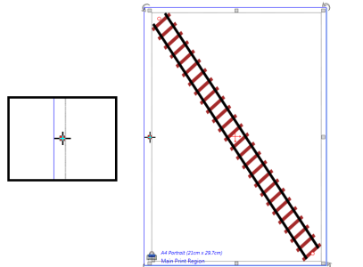

---

sidebar_position: 22

---
# Resizing with the Resize Handles

You can also change the size of your object with the resize handles. Unlike the control points which change the shape of the object, the resizing handles stretch and shrink your selection.

**To resize with the resize handles:**

- Select the item you wish to resize.
- Drag either of the resize handles to stretch or shrink the object. (If you hold **SHIFT** while you resize, the length to width ratio of your object will be maintained).

    

    **Note**: The cursor has changed as it hovers over the resize handle. This means it is ready to move the handle.
