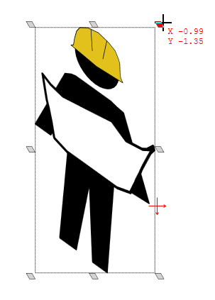

---

sidebar_position: 23

---
# Resizing with the Skew handles

Create pseudo perspective views by holding Ctrl+Alt to turn object scale handles into skew handles.

When you have your sign/object selected, simply hold the Ctrl+Alt keys to activate the skew handles. You can then adjust the skew of the object with these keys held down, as you can see in Figure 5.15 below.

