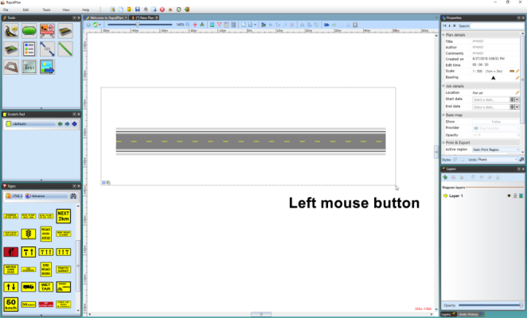
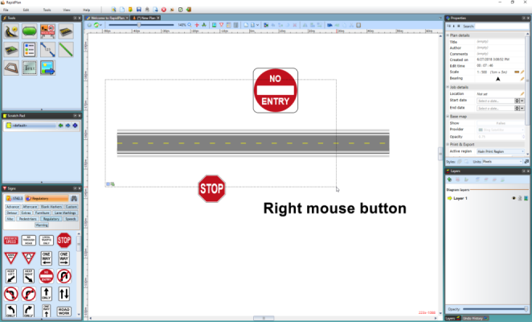

---

sidebar_position: 5

---
# Select with a Selection Box 

The other way to select an object is by dragging a selection box around it. Simply click outside the bounds of your object, and drag the selection box out until it completely encompasses it. Release the mouse, and your object will be selected.

**Note**: The selection box will only capture items that are completely surrounded by the selection box. However, if you hold **right mouse button** whilst dragging the selection box over the objects, it will select all of the objects in the selection box, even if partially covered.

