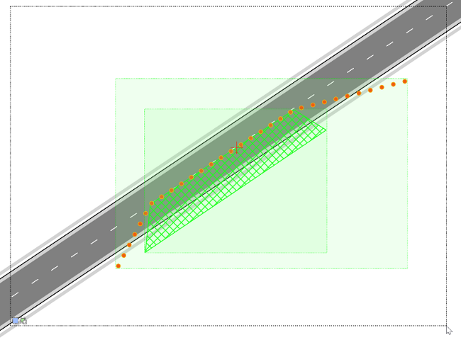
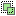

---

sidebar_position: 6

---
# Selection preview

Any objects that have been highlighted in the selection box will be highlighted in green, indicating what you have selected.

The below are the available selection modes when selecting objects:

 **Selection modes**
 New selection (default)
 Add to selection (hold Shift key)
 Remove from selection (hold Alt key)    

**Capture modes**
 Contained objects (default)
 Intersecting objects (use right mouse button)

